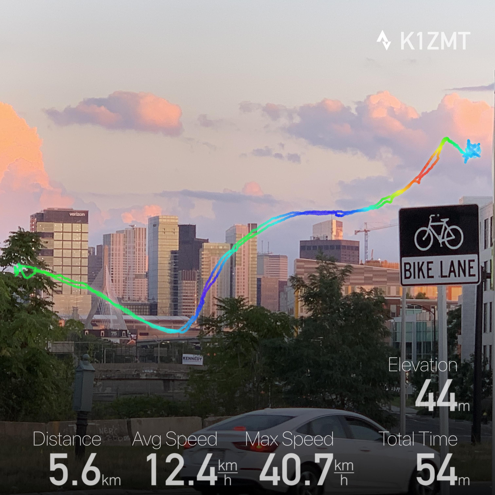

# GPX to Instagram

Tiny utility to convert GPX track from Strava to an Instagram image.

Made just for fun. 

## Getting started

```shell
npm install -g gpx-to-instagram
```

## Usage
```shell
gpx2instagram -g your-ride.gpx -i input-image.jpeg -o output-image.jpg -a K1ZMT
```

Will produce the following image



### Command line interface 

```
Usage: gpx2instagram -g Ride.gpx -i sky.jpg -d sky-ride.jpg

Options:
      --version  Show version number                                   [boolean]
  -g, --gpx      Input GPX file                              [string] [required]
  -i, --image    Input image to be drawn on                  [string] [required]
  -o, --output   Output image path. Creates new image with o suffix.    [string]
  -a, --athlete  Athlete vanity sign.                     [string] [default: ""]
  -h, --help     Show help                                             [boolean]
```

###### Disclaimer

Distribution includes Strava logo. It belongs to Strava. 
All copyright shit applies.
